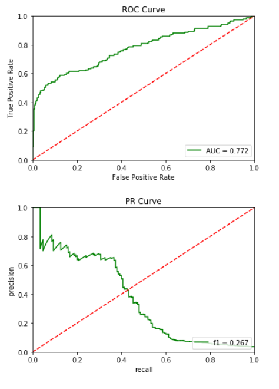

# compounds-that-inhibits-HIV-replication

## Feature

該項目為binary classification，一開始擁有的feature僅smile分子結構，得預測該分子有無對HIV活性，資料來源於http://moleculenet.ai/datasets-1 , https://wiki.nci.nih.gov/display/NCIDTPdata/AIDS+Antiviral+Screen+Data 。


除了使用rdtoolkit取得該分子的分子量、tpsa、價電子數量、異原子數量等，將smile分子結構使用[mol2vec](https://pubs.acs.org/doi/10.1021/acs.jcim.7b00616)可得到300維vector。
[mol2vec](https://pubs.acs.org/doi/10.1021/acs.jcim.7b00616)是透過word embedding方法，使用morgan fingerprint取得的各分子部位結構作為單字，一個分子視一個句子，建立neural 
network去預測句子中所空缺的單子(CBOW)或用單字預測去預測所連接的句子(skip-graw)。經過大量分子訓練後，neural network轉換分子的morgan fingerprint形成一個300維的vector。

比較Active和Non-active的數量差異，顯然Non-active數量稀少，應以True positive rate (precision)來評價模型較為合適。模型Xgboost中使用max_delta_step來減緩case imbalance之影響。


## Pipeline

下圖為所建立之pipeline，Feature selection 考慮以下兩點:

1. 因rdtoolkit所取得的分子性質是有可能涵蓋在mol2vec所得到的300維度中，因此試著比較將分子性質排除之後的結果。

2. 試著用pca下降mol2vec所得到的300維度，通常高維度對分類不利。

最後將結果儲存於MongoDB。


## 結果比較

xgboost優化前結果。



使用grid search優化xgboost後結果。


```
results = collection.find({'f1': {'$gt': 0.35}}).sort('f1')
for d in results:
    d.pop('_id')
    print(d.pop('f1'))
    print(d)
    print('------')
```

```
0.3552735876959479
{'FeatureMask': {'mask': None}, 'PCA': {'n_components': None}, 'clf': {'learning_rate': 0.3, 'max_delta_step': 1, 'max_depth': 4, 'min_child_weight': 64, 'n_estimators': 200, 'scale_pos_weight': 1}, 'f1_std': 0.006185103215104007, 'kfold': 3}
------
0.3572928070420459
{'FeatureMask': {'mask': None}, 'PCA': {'n_components': None}, 'clf': {'learning_rate': 0.3, 'max_delta_step': 1, 'max_depth': 3, 'min_child_weight': 32, 'n_estimators': 200, 'scale_pos_weight': 1}, 'f1_std': 0.02214534442500987, 'kfold': 3}
------
0.35862440097664894
{'FeatureMask': {'mask': ['tpsa', 'mol_w', 'num_valence_electrons', 'num_heteroatoms']}, 'PCA': {'n_components': None}, 'clf': {'learning_rate': 0.3, 'max_delta_step': 1, 'max_depth': 4, 'min_child_weight': 64, 'n_estimators': 200, 'scale_pos_weight': 1}, 'f1_std': 0.009445260801050471, 'kfold': 3}
------
0.35949312456087523
{'FeatureMask': {'mask': ['tpsa', 'mol_w', 'num_valence_electrons', 'num_heteroatoms']}, 'PCA': {'n_components': None}, 'clf': {'learning_rate': 0.3, 'max_delta_step': 5, 'max_depth': 4, 'min_child_weight': 32, 'n_estimators': 200, 'scale_pos_weight': 1}, 'f1_std': 0.00291910252624212, 'kfold': 3}
------
0.35949312456087523
{'FeatureMask': {'mask': ['tpsa', 'mol_w', 'num_valence_electrons', 'num_heteroatoms']}, 'PCA': {'n_components': None}, 'clf': {'learning_rate': 0.3, 'max_delta_step': 10, 'max_depth': 4, 'min_child_weight': 32, 'n_estimators': 200, 'scale_pos_weight': 1}, 'f1_std': 0.00291910252624212, 'kfold': 3}
------
0.3613353603721658
{'FeatureMask': {'mask': None}, 'PCA': {'n_components': None}, 'clf': {'learning_rate': 0.3, 'max_delta_step': 5, 'max_depth': 4, 'min_child_weight': 64, 'n_estimators': 200, 'scale_pos_weight': 1}, 'f1_std': 0.0012076153514451408, 'kfold': 3}
------
0.3613353603721658
{'FeatureMask': {'mask': None}, 'PCA': {'n_components': None}, 'clf': {'learning_rate': 0.3, 'max_delta_step': 10, 'max_depth': 4, 'min_child_weight': 64, 'n_estimators': 200, 'scale_pos_weight': 1}, 'f1_std': 0.0012076153514451408, 'kfold': 3}
------
0.37505545041578126
{'FeatureMask': {'mask': None}, 'PCA': {'n_components': None}, 'clf': {'learning_rate': 0.3, 'max_delta_step': 1, 'max_depth': 4, 'min_child_weight': 32, 'n_estimators': 200, 'scale_pos_weight': 1}, 'f1_std': 0.010711874405978422, 'kfold': 3}
------
0.3768233097659955
{'FeatureMask': {'mask': None}, 'PCA': {'n_components': None}, 'clf': {'learning_rate': 0.3, 'max_delta_step': 5, 'max_depth': 4, 'min_child_weight': 32, 'n_estimators': 200, 'scale_pos_weight': 1}, 'f1_std': 0.0024825429649907673, 'kfold': 3}
------
0.3768233097659955
{'FeatureMask': {'mask': None}, 'PCA': {'n_components': None}, 'clf': {'learning_rate': 0.3, 'max_delta_step': 10, 'max_depth': 4, 'min_child_weight': 32, 'n_estimators': 200, 'scale_pos_weight': 1}, 'f1_std': 0.0024825429649907673, 'kfold': 3}
------
0.37723540878804857
{'FeatureMask': {'mask': ['tpsa', 'mol_w', 'num_valence_electrons', 'num_heteroatoms']}, 'PCA': {'n_components': None}, 'clf': {'learning_rate': 0.3, 'max_delta_step': 1, 'max_depth': 4, 'min_child_weight': 32, 'n_estimators': 200, 'scale_pos_weight': 1}, 'f1_std': 0.013212770344484849, 'kfold': 3}
```

1. f1 score增加許多，PR curve僅有些許進步。f1 score採用therhold為0.5，代表優化前的機率即便大於0.5準確率也很低。

2. 分數高者皆沒有經過降維，可見molevec所產生的維度都個能代表一部分分子的表現，不應隨意剪去。


